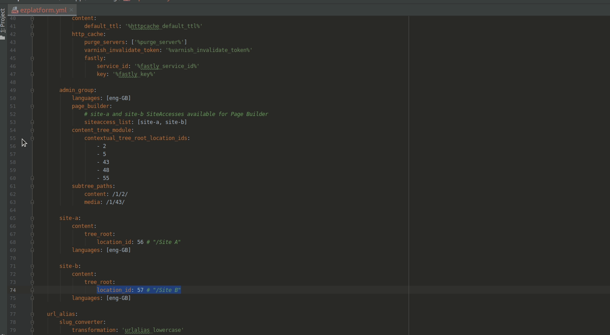

# ezplatform-page-builder-multisite-siteaccess-picker


## Description
The bundle provides an alternative way of selecting SiteAccess for PageBuilder when Landing Page
is edited by clicking on the "Edit" button.
By default last used SiteAccess is taken and this Bundle changes this behavior so it
is better suited for the Multisite setup.

If Landing Page is outside of last used SiteAccess Subtree, first SiteAccess that shares 
Subtree with Landing Page will be used. In addition, selected Translation will be taken into account when determining 
correct SiteAccess. If SiteAccess with matching Language *and* Subtree can't be find, 

The same behavior is used when the Landing Page is created.

*Please note that this may result in Editor not being able to create/edit Landing Page if there is no available SiteAccess for the Subtree.*


## Configuration
You can disable limiting of displayed SiteAccesses in the "Page" tab by setting `mateusz_bieniek.multisite.limit_for_page_tag` parameter to `false`:
```
parameters:
    # ...
    mateusz_bieniek.multisite.limit_for_page_tag: false
```
## Installation
**Requires eZ Platform Enterprise Edition 2.5 LTS**

### 1. Enable `EzPlatformPageBuilderMultisiteSiteaccessPickerBundle`
Edit `app/AppKernel.php`, and add 
```
new MateuszBieniek\EzPlatformPageBuilderMultisiteSiteaccessPickerBundle\EzPlatformPageBuilderMultisiteSiteaccessPickerBundle(),
```
at the end of the `$bundles` array.
### 2. Install `mateuszbieniek/ezplatform-page-builder-multisite-siteaccess-picker`
```
composer require mateuszbieniek/ezplatform-page-builder-multisite-siteaccess-picker
```
